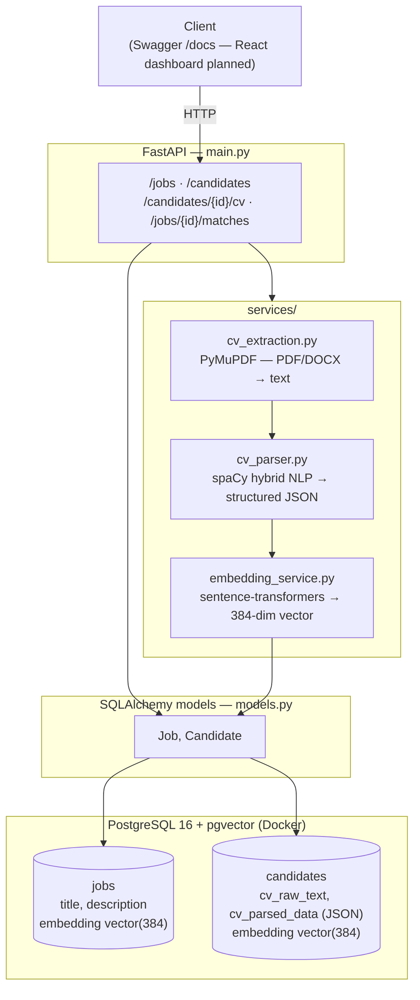

# HR Platform — AI-Powered Recruitment & Candidate Matching

A backend system that parses CVs, extracts structured candidate data using NLP, and semantically
matches candidates to job postings using sentence embeddings and vector similarity search.

Built as a solo portfolio project to demonstrate practical, production-style use of NLP and vector
search — not a toy keyword matcher, and not a wrapper around a third-party AI API.

---

## What it does

1. **Upload a CV** (PDF or DOCX) → text is extracted, parsed into structured fields (name, email,
   phone, skills, education, companies, years of experience), and embedded as a vector.
2. **Post a job** → its description is embedded as a vector.
3. **Query `/jobs/{id}/matches`** → Postgres (via pgvector) ranks all candidates by cosine
   similarity to the job, in a single SQL query — no separate vector database required.

### Example result

Same candidate CV (a DevOps/SRE résumé heavy on Kubernetes, Terraform, AWS) scored against two
different job postings:

| Job posting              | Similarity score |
|---------------------------|:-----------------:|
| Senior DevOps Engineer    | **0.6472**        |
| Marketing Manager         | 0.3189            |

The embeddings correctly separate a relevant match from an irrelevant one — this isn't keyword
matching, it's semantic similarity computed from meaning, not exact word overlap.

---

## Architecture



**Flow:** a CV upload goes through extraction → parsing → embedding before being saved; job
postings are embedded directly from their description. The `/jobs/{id}/matches` route reads
straight from the database, running a cosine-distance query natively in Postgres via pgvector —
no separate vector store or Python-side similarity computation involved.

---

## Tech stack

| Layer | Technology | Why |
|---|---|---|
| API | FastAPI | Async-ready, auto-generated OpenAPI docs, strong typing via Pydantic |
| ORM / migrations | SQLAlchemy + Alembic | Type-safe models, versioned schema changes |
| Database | PostgreSQL 16 + pgvector | Native vector similarity search — no separate vector DB needed |
| PDF/DOCX extraction | PyMuPDF, python-docx | PyMuPDF chosen after pypdf failed on LaTeX-generated CVs (word-smashing, broken kerning) |
| NLP / entity extraction | spaCy (`en_core_web_sm`) + custom `EntityRuler` pipelines | Hybrid: NER for names/orgs/locations, rule-based matching for skills/education |
| Skills taxonomy | [Jobzilla skills dataset](https://github.com/kingabzpro/jobzilla_ai) (2,129 real-world skill patterns) | Industry-sourced taxonomy instead of a hand-typed skill list |
| Embeddings | sentence-transformers (`all-MiniLM-L6-v2`) | Free, fast, 384-dim, strong quality-to-size ratio |
| Containerization | Docker Compose (Postgres) | Reproducible local dev environment |

---

## How CV parsing works

Resume parsing is a genuinely hard NLP problem — pure NER isn't reliable on its own. This project
uses a hybrid pipeline, the same shape used in real-world resume parsers:

- **Regex** — email, phone, years of experience (spaCy doesn't extract these reliably)
- **spaCy NER** — companies (`ORG`), locations (`GPE`)
- **`EntityRuler` (skills)** — matched against the Jobzilla taxonomy, running *before* core NER
  with `overwrite_ents=True` so real skill matches always win over NER's guesses
- **`EntityRuler` (education)** — degree phrases/abbreviations and school keywords, same
  before-NER priority pattern
- **First-line heuristic (name)** — the candidate's name is (almost) always the first line of a
  résumé; this is more reliable across non-Western names than spaCy's `PERSON` NER, which is
  trained predominantly on Western name patterns

### Known limitations

- `companies`/`locations` extraction still occasionally misfires on acronyms or short strings —
  bullet-fragment and run-on noise is filtered, but NER on short all-caps tokens (e.g. "SRE",
  "IP") remains imperfect. A labeled resume-specific NER model would fix this; out of scope for
  a solo project at this stage.
- Text extraction quality depends on how the source PDF was generated — PyMuPDF handles most
  formats well, but heavily styled templates can still lose some formatting fidelity.

---

## Setup

### Prerequisites
- Python 3.11+
- Docker Desktop

### 1. Clone and set up the environment
```bash
git clone https://github.com/bbokka/hr-plateform.git
cd hr-plateform
python -m venv venv
venv\Scripts\Activate.ps1        # Windows
pip install -r requirements.txt
python -m spacy download en_core_web_sm
```

### 2. Start PostgreSQL (with pgvector)
```bash
docker-compose up -d
```

### 3. Run migrations
```bash
alembic upgrade head
```

### 4. Download the skills taxonomy
```bash
python scripts/download_skills.py
```

### 5. Run the API
```bash
uvicorn main:app --reload
```

Visit `http://127.0.0.1:8000/docs` for the interactive API explorer.

---

## Roadmap

- [x] PostgreSQL + Docker setup, CRUD for jobs/candidates
- [x] CV upload with PDF/DOCX text extraction
- [x] Hybrid NLP entity extraction (spaCy + rule-based, real skills taxonomy)
- [x] Vector embeddings + pgvector semantic matching
- [ ] React + TypeScript candidate tracking dashboard
- [ ] Automated test suite (pytest)
- [ ] CI pipeline (GitHub Actions)

**Deferred (deliberately out of scope for a solo portfolio project):** LinkedIn ingestion, SIRH
integration, full career management modules — cut early to keep the core demonstrable and
buildable solo, not because they weren't considered.

---

## License

MIT